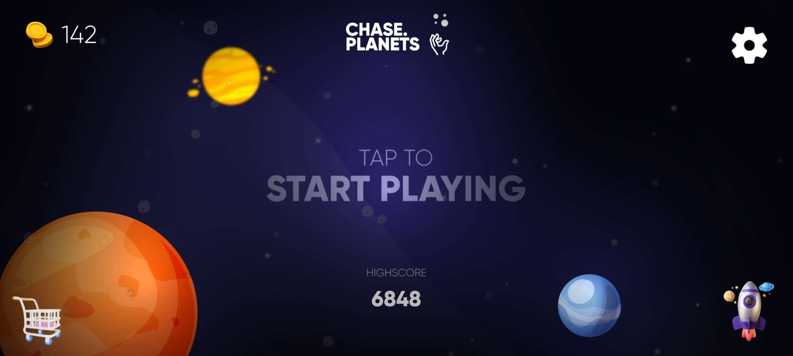
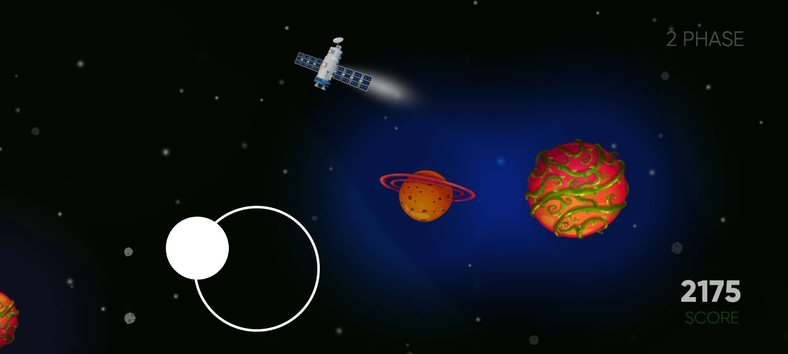
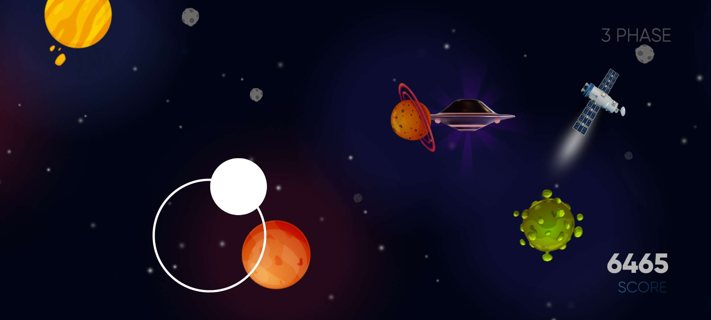
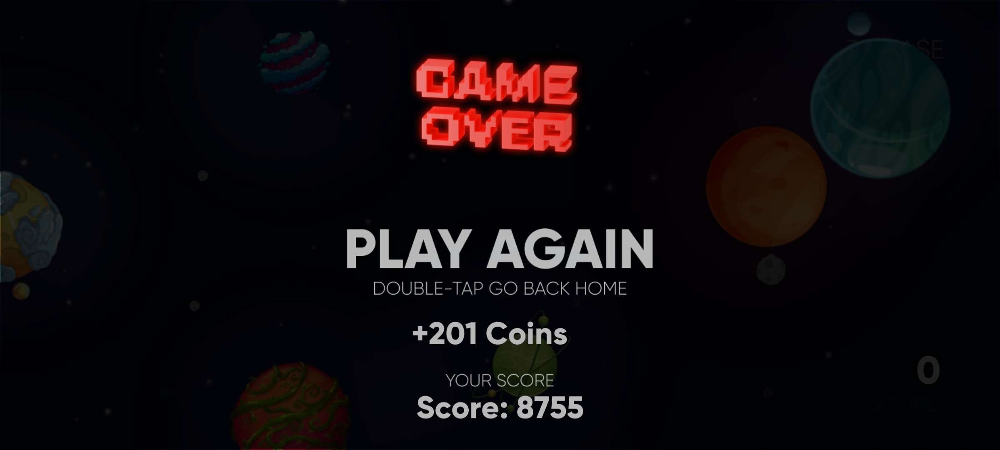
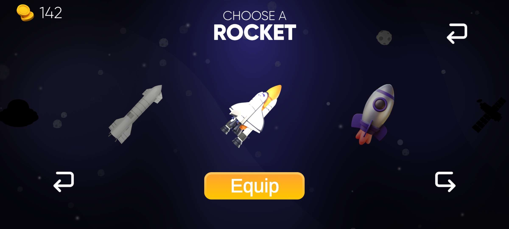

  

# Chase Planets

Ein mobiles Arcade-Game, bei dem du eine Rakete durch den Weltraum steuerst und gefährlichen Planeten, Meteoroiden und Hindernissen ausweichst.

Schnelles Gameplay, klares Ziel: **so lange wie möglich überleben**.

  
  

---

## Gameplay

Du steuerst eine Rakete durch ein dynamisches Weltraum-Level.  
Planeten haben unterschiedliche Eigenschaften – manche sind harmlos, andere tödlich.  
Zusätzlich erscheinen Meteoroiden, Power-Ups und Items, die dein Spiel beeinflussen.

Das Spiel ist in **Phasen** unterteilt, die mit der Zeit schwieriger werden.

---

## Features

- Direkte, präzise Steuerung
- Gefährliche & harmlose Planeten
- Meteoroiden und andere Hindernisse
- Power-Ups & Items
- Phasen-System mit steigendem Schwierigkeitsgrad
- Score- & Coin-System
- Auswahl verschiedener Raketen

---

  
  

## Technik

Das Spiel wurde mit **Unity** entwickelt.

---

## Lokale Entwicklung

Projekt mit Unity öffnen und starten.  
Weitere Abhängigkeiten sind nicht notwendig.

---

## Mitmachen

Feedback, Bugreports oder Ideen sind willkommen.

---

## Lizenz

MIT
